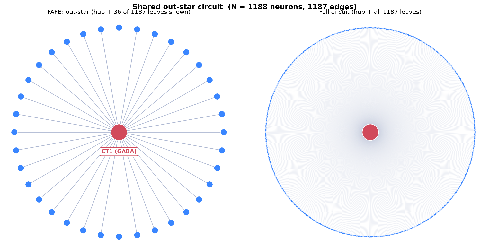
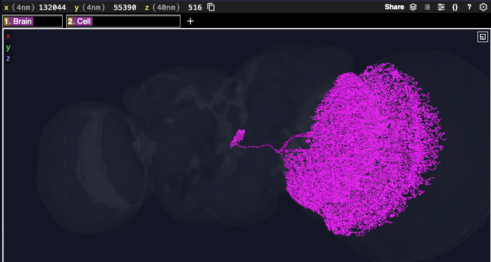

# The Shared Circuit and What It Means

*[Your name] – FlyWire challenge – [date]*

## What I found

I found the same circuit shape in three datasets (MCNS, FAFB, and MAOL): a "star"
of **1,188 neurons** – one central hub neuron that connects out to 1,187 others,
and those 1,187 don't connect to each other. It's the same in all three datasets,
with the connections pointing the same direction. I matched the neurons by their
wiring only, not by cell type, so they aren't the same cells – they just have the
same shape.

**Figure 1.** The star, shown for FAFB. Left: the hub (CT1) with 36 of its 1,187
leaves so you can actually see the shape. Right: the full circuit with all 1,187
leaves – it looks dense because the one hub connects to so many neurons at once.

## The biology

I looked up the hub neuron from FAFB on Codex (its ID is `720575940628908548`),
and it turned out to be **CT1**, which is a really well-known neuron in the fly's
vision system. Codex lists its neurotransmitter as **GABA**, so it's an inhibitory
neuron (it quiets down the cells it connects to).

CT1 is unusual because it's a single giant cell that reaches into basically every
part of the optic lobe. People have described it as one cell that acts like about
1,400 little cells, because each part of it works almost on its own. It connects to
the T4 and T5 neurons, which are the cells that detect motion, and it helps make
their direction sensing sharper.

What I think this means: the shape I found – one neuron sending signals out to
~1,187 others that don't talk to each other – lines up really well with what CT1
actually is, which is one cell broadcasting out to a huge number of targets all
over the optic lobe. So even though I found this just from the wiring numbers, it
matches a real, known neuron, which I thought was cool. It also makes sense that
the other two datasets (MCNS and MAOL) had similar big hubs, since they also
include a lot of the optic lobe – but I want to be clear those aren't necessarily
the same cell, they just have the same shape.

**Figure 2.** The 3D shape of CT1 in FAFB from Codex (ID `720575940628908548`).

## References

1. Takemura S, et al. (2017). The comprehensive connectome of a neural substrate
   for 'ON' motion detection in *Drosophila*. *eLife* 6:e24394.
2. Meier M, Borst A (2019). Extreme compartmentalization in a *Drosophila* amacrine
   cell. *Current Biology* 29(7):1545–1550.
3. Shinomiya K, et al. (2019). Comparisons between the ON- and OFF-edge motion
   pathways in the *Drosophila* brain. *eLife* 8:e40025.
4. Dorkenwald S, et al. (2024). Neuronal wiring diagram of an adult brain
   (FlyWire/FAFB). *Nature*.
